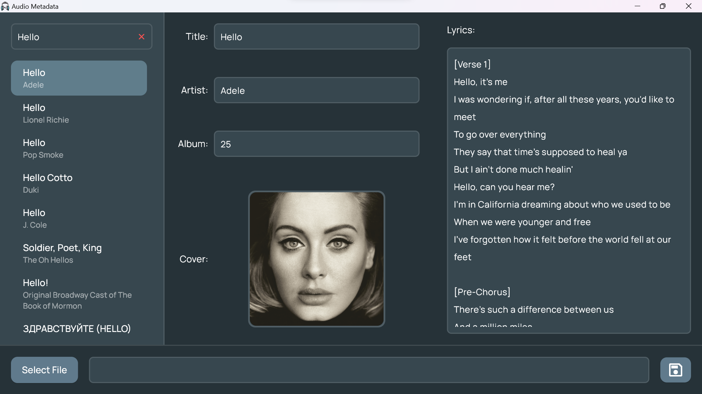

# Audio-Metadata
A Windows application to modify metadata for MP3 and FLAC files. Uses the [Genius](https://genius.com/) API for metadata retrieval.

## API Key (Required)
Please create a `.env` file at the root of the project with the API key in the following format:
```
API_KEY=XXX
```
You can obtain an API key from [here](http://genius.com/api-clients).

## Screenshots



## Acknowledgements
- [Freepik](https://www.flaticon.com/premium-icon/headphone_1890782) for the application logo.
- [Taggy](https://github.com/DMouayad/taggy) for writing metadata onto the audio files.
